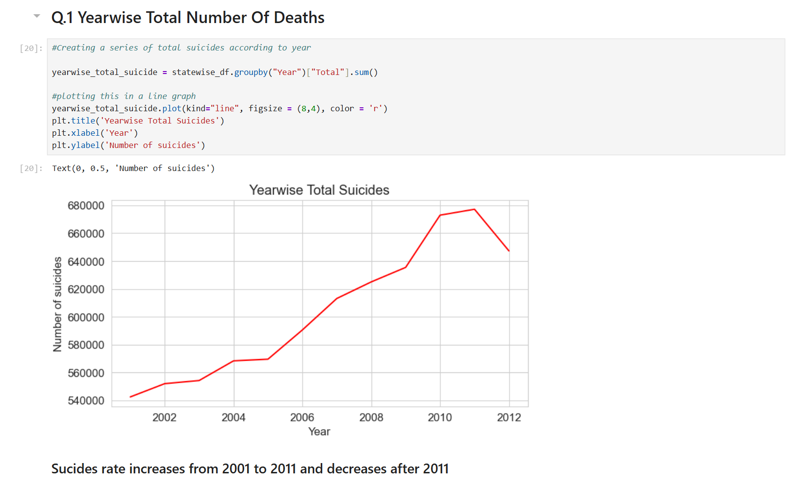
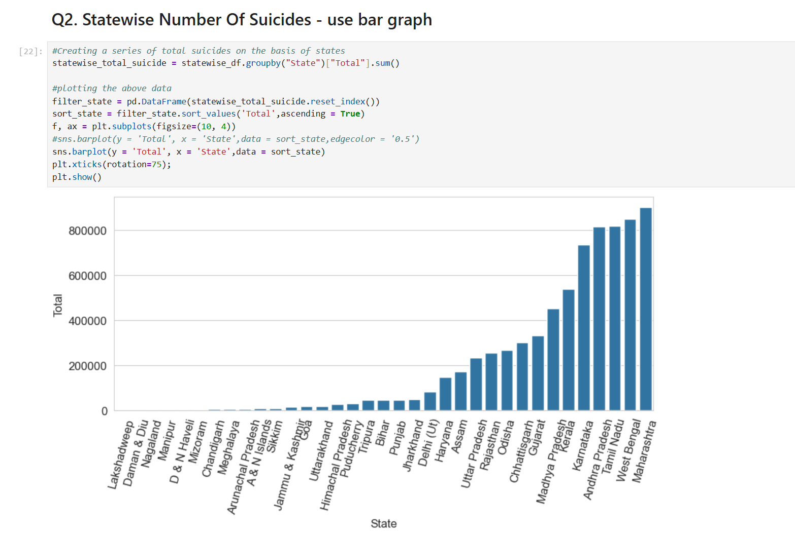

# Suicide Rate Analysis

##  Project Overview
This project analyzes suicide rates across different years and states using a dataset. The analysis helps in understanding trends over time and identifying regions with high suicide rates. Visualizations are used to present insights effectively.

##  Dataset
- **Filename:** `sucides-rate-data-set.csv`
- **Contains:** Year-wise and state-wise suicide data
- **Columns:** Year, State, Total Suicides, etc.

##  Technologies Used
- **Programming Language:** Python
- **Libraries:** `pandas`, `numpy`, `matplotlib`, `seaborn`

##  How to Run the Project
1. Install dependencies:
   ```bash
   pip install pandas numpy matplotlib seaborn
   ```
2. Run the Jupyter Notebook:
   ```bash
   jupyter notebook suicides_analysis.ipynb
   ```

##  Screenshots
Below are some sample visualizations from the analysis:

### **Year-wise Suicide Trends**


### **State-wise Suicide Comparison**


##  Overall Explanation Behind the Analysis

This project aims to analyze suicide trends over the years and across different states using statistical and visual techniques. The primary goal is to:

1. **Identify Trends:**
   - Understanding how suicide rates have changed over time helps in recognizing social and economic factors contributing to the rise or fall in numbers.

2. **State-wise Comparison:**
   - Some states have significantly higher suicide rates than others. Identifying these states can help policymakers and researchers focus on areas needing intervention.

3. **Data-Driven Insights:**
   - By using visualizations like bar charts and line graphs, we can easily interpret patterns and provide meaningful insights from raw data.

4. **Year-wise Total Number of Deaths**
   - Identifies trends in suicide rates over the years.
   - Insight: Suicide rates increased from 2001 to 2011 but declined after 2011.
   
5. **State-wise Number of Suicides**
   - Uses bar graphs to compare suicide rates across states.
     
This type of analysis can contribute to further studies, enabling researchers to understand and mitigate factors leading to suicides.

##  License
This project is open-source and available under the MIT License.

